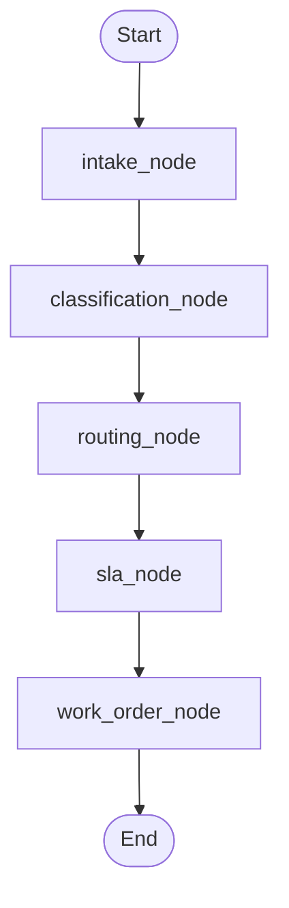

# FlowDesk Workflow Development Guide

This guide explains how [workflow.py](file:///D:/flowdesk/backend/workflow.py) operates within the **FlowDesk** architecture and details a step-by-step plan to implement all nodes and support helpers.

---

## 1. How `workflow.py` Works

FlowDesk processes student complaints using **LangGraph**, which models the system as a state machine. Instead of a free-form chatbot, the workflow runs a structured, linear pipeline of specialized **nodes**.

### The Flow of Data
1. **`GraphState`**: A dictionary containing all variables (e.g., raw message, category, assigned department, SLA deadline, etc.) is passed from node to node.
2. **State Updates**: Each node takes the current `GraphState`, performs its specific task, and returns a dict with updated or new key-value pairs. LangGraph automatically merges these updates into the shared state.
3. **Execution Path**: The execution follows a linear sequence:

---

## 2. Node Responsibilities

Here is the breakdown of what each node in [workflow.py](file:///D:/flowdesk/backend/workflow.py) must do:

### A. [intake_node](file:///D:/flowdesk/backend/workflow.py#L19-L28)
* **Objective**: Parse, normalize, and initialize the ticket state.
* **Steps**:
  1. Retrieve the student record from the database using `state["telegram_id"]`.
  2. If found, set `student_id` (their primary key/username).
  3. Extract or construct a clean `title` (e.g., summarize the complaint to a few words) and `description`.
  4. Look for an optional `location` (defaulting to `"Unknown"` if not specified).
  5. Initialize `status` to `"Open"`.
  6. Return the updated keys.

### B. [classification_node](file:///D:/flowdesk/backend/workflow.py#L30-L36)
* **Objective**: Automatically determine category and priority.
* **Steps**:
  1. Pass the description to [classify_complaint](file:///D:/flowdesk/backend/classifier.py#L13-L28).
  2. The classifier uses LLM reasoning to output a valid category (e.g., `"IT & Wi-Fi"`) and priority (e.g., `"High"`).
  3. Return `category` and `priority`.

### C. [routing_node](file:///D:/flowdesk/backend/workflow.py#L38-L44)
* **Objective**: Assign the ticket to the responsible department.
* **Steps**:
  1. Pass the `category` to [route_ticket](file:///D:/flowdesk/backend/router.py#L12-L28).
  2. The router maps it to a department name (e.g., `"IT Department"`).
  3. Return `assigned_dept`.

### D. [sla_node](file:///D:/flowdesk/backend/workflow.py#L46-L52)
* **Objective**: Calculate the target resolution deadline.
* **Steps**:
  1. Set the creation timestamp (`created_at`) to the current UTC time if not already set.
  2. Pass `priority` and `created_at` to [calculate_sla_deadline](file:///D:/flowdesk/backend/sla.py#L14-L35).
  3. Return `sla_deadline` (ISO-8601 string) and `created_at`.

### E. [work_order_node](file:///D:/flowdesk/backend/workflow.py#L54-L61)
* **Objective**: Save the fully enriched state and trigger side-effects.
* **Steps**:
  1. Call [create_ticket](file:///D:/flowdesk/backend/db.py#L65-L68) with a `TicketCreate` model constructed from the state.
  2. Retrieve the generated `ticket_id` and save it to the state.
  3. Log the system events in the `events` table (e.g., `TICKET_CREATED`, `CLASSIFIED`, `ROUTED`, `SLA_ASSIGNED`).
  4. Format a telegram message using `format_ticket_reply` and queue a notification using `create_notification`.

---

## 3. Recommended Development Roadmap

To implement the workflow cleanly, you should build the foundation first and then compile the graph. Follow this order:

### Phase 1: Database & Seed Data
* Implement [backend/db.py](file:///D:/flowdesk/backend/db.py) functions:
  * `get_connection`: SQLite connection with `row_factory = sqlite3.Row`.
  * `init_db`: Create tables for `users`, `tickets`, `events`, `departments`, and `notifications`, seeding departments.
  * CRUD helpers (`create_user`, `get_user_by_telegram_id`, `create_ticket`, `create_event`, `create_notification`).
* Complete [scripts/seed_data.py](file:///D:/flowdesk/scripts/seed_data.py) to populate the database with mock students, staff, and tickets.

### Phase 2: Core Helpers
* **Router**: Implement [backend/router.py](file:///D:/flowdesk/backend/router.py) mapping category to department.
* **SLA**: Implement [backend/sla.py](file:///D:/flowdesk/backend/sla.py) using `datetime` arithmetic to add `SLA_HOURS` to creation time.
* **Classifier**: Implement [backend/classifier.py](file:///D:/flowdesk/backend/classifier.py). Use the LLM API (via `google-genai`, `openai`, or a simple structured request using `httpx`) to analyze text and return valid category/priority strings.

### Phase 3: LangGraph Integration
* Implement [backend/workflow.py](file:///D:/flowdesk/backend/workflow.py):
  1. Complete node functions.
  2. Implement `build_graph()` using `StateGraph`.
  3. Implement `run_workflow()` to compile the graph, construct the initial state, execute the graph, and return the final state.

### Phase 4: Verification
* Run tests or write simulation scripts like [scripts/run_demo.py](file:///D:/flowdesk/scripts/run_demo.py) to ensure tickets are correctly stored.
