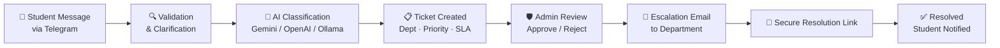

# 🏫 FlowDesk — Smart Campus Complaint Workflow

> **Campus complaints don't fail because nobody cares. They fail because the system around them is messy.**

[](https://fastapi.tiangolo.com)
[](https://streamlit.io)
[](https://sqlite.org)
[](https://developers.google.com/identity)
[](https://python.org)
[](LICENSE)

---

## 😤 The Problem

A student reports broken Wi-Fi, a leaking pipe, or a dead projector. The message lands in the wrong chat, gets forwarded twice, loses context, and becomes someone else's problem.

**Informal systems** (WhatsApp, email) are fast but impossible to track:

- 💬 Messages buried under newer messages
- 🔀 Email threads split across departments
- ❓ Students never know if anyone saw the complaint
- ⏰ Admins can't tell what's overdue

**Heavy systems** (portals, forms) solve tracking but students avoid them:

- 📋 Too many forms
- 🔐 Too many login walls
- 🚫 Too much friction for a broken fan

> FlowDesk sits between those two extremes — lightweight for students, structured for the institution.

---

## 💡 The Solution

FlowDesk turns a plain-language Telegram message into a fully tracked operational workflow.



A student simply types:

```
/ticket Wi-Fi is not working in the library second floor
```

Behind that message, FlowDesk handles **identity verification, validation, routing, priority, department assignment, SLA tracking, and event history**.

---

## ✨ Features

### 🎓 For Students

| Feature | Description |
|---------|-------------|
| **Telegram Intake** | Create tickets directly from Telegram — no app downloads |
| **Google Identity** | Link Telegram to verified Google account via `/link` |
| **Smart Follow-ups** | AI asks clarifying questions when complaints are too vague |
| **Live Status** | Check ticket progress via `/status` or the Student Portal |
| **Full History** | Complaint history tied to verified student identity |

### 🛡️ For Admins

| Feature | Description |
|---------|-------------|
| **Streamlit Dashboard** | Review, approve, reject, and reassign tickets |
| **SLA Tracking** | Track department, priority, overdue tickets, and event logs |
| **Department Management** | Manage departments and escalation email IDs |
| **Auto-Escalation** | Approved tickets move to `Escalated` for department action |

### 🏢 For Departments

| Feature | Description |
|---------|-------------|
| **Structured Emails** | Receive formatted escalation emails with full ticket context |
| **No Dashboard Needed** | Get ticket details without needing login access |
| **One-Click Resolution** | Mark work resolved through a secure one-time link |

---

## 💬 Why Telegram?

Because complaint intake should not start with a login wall.

Telegram gives students a **low-friction entry point**, while Google OAuth gives the backend a **verified identity**. The combination keeps reporting lightweight without making the system anonymous or untrackable.

---

## 🛠️ Tech Stack

| Layer | Technology | Badge |
|-------|-----------|-------|
| **Student Intake** | Telegram Bot API |  |
| **Frontend** | Streamlit |  |
| **Backend** | FastAPI |  |
| **Auth** | Google OAuth |  |
| **Database** | SQLite |  |
| **AI Routing** | Gemini / OpenAI / Ollama |  |
| **Email** | SMTP (mock-email fallback) |  |
| **Tunneling** | ngrok |  |

---

## 🔄 Core Flow

```
1. 🔗  Student links Telegram with Google using /link
2. 📝  Student submits complaint using /ticket
3. 🔍  FlowDesk validates and asks for missing details
4. 🤖  LLM classifies issue and suggests routing metadata
5. 📋  Ticket created with department, priority, SLA, and history
6. 🛡️  Admin reviews — approves or rejects
7. 📧  Approved tickets move to Escalated → department gets email
8. 🔗  Department clicks secure link after completing work
9. ✅  Ticket marked resolved — visible in student history
```

---

## 🚀 Quick Start

> For the full setup (Telegram, Google OAuth, ngrok, SMTP, LLM config), see **[LOCAL_SETUP_GUIDE.md](LOCAL_SETUP_GUIDE.md)**

### Prerequisites

- 🐍 Python 3.11+
- 🤖 Telegram Bot Token
- 🔑 Google OAuth Credentials
- 🌐 ngrok account (for local callbacks)

### Installation

```bash
git clone https://github.com/qonstellations/flowdesk.git
cd flowdesk
uv sync
cp .env.example .env
# Edit .env with your keys
```

### Run Backend

```bash
uv run uvicorn backend.webhook:app --host 0.0.0.0 --port 8000 --reload
```

### Run Frontend

```bash
uv run streamlit run app/main.py
```

### Open

```
http://localhost:8501
```

---

## 📧 Email Behavior

FlowDesk supports real SMTP email, but **local development doesn't require it**.

If `SMTP_HOST` or `SMTP_USER` is empty, generated emails are written to:

```
data/mock_emails/
```

> [!TIP]
> This makes the department escalation flow fully testable without sending real mail. For real recipients, configure SMTP and set `BASE_URL` to a public URL (e.g., an ngrok HTTPS URL).

---

## 📁 Repository Map

```
📦 flowdesk
├── 📂 app/                  Streamlit frontend
│   ├── 📂 pages/            Admin dashboard & student portal
│   └── 📂 components/       Shared ticket UI components
├── 📂 backend/              FastAPI, Telegram, auth, workflow, DB, email
├── 📄 LOCAL_SETUP_GUIDE.md  Full local setup instructions
├── 📄 .env.example          Environment variable template
└── 📄 README.md             You are here
```

---

## 📌 Current Status

FlowDesk is an **active MVP**. The main loop is fully in place:

✅ Verified student intake via Telegram
✅ Complaint validation with AI follow-ups
✅ LLM-assisted routing & classification
✅ Admin triage dashboard
✅ Department escalation via email
✅ Secure one-click resolution tracking

---

## 📜 License

MIT — see [LICENSE](LICENSE)

---

<p align="center">
  Built with ❤️ by <strong>Team Makhan Chor</strong>
</p>
